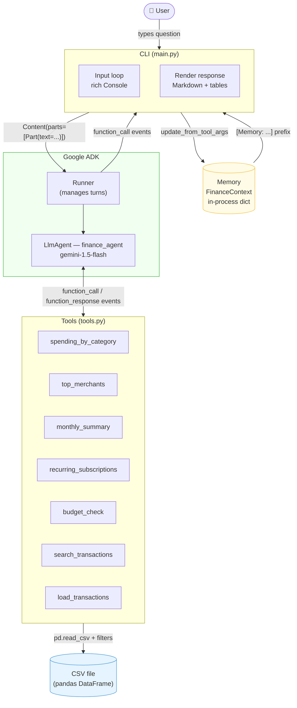

# Architecture

The Personal Finance Agent is a single-process Python application that wraps
a Google Gemini model with a set of deterministic pandas-based tools and a
lightweight in-process memory layer.

## Components

| Component | File | Responsibility |
|-----------|------|----------------|
| **CLI** | `main.py` | Prompt loop, startup banner, context injection, response rendering |
| **LlmAgent** | `agent.py` | Wraps Gemini; holds the system instruction and tool registry |
| **Runner** | ADK built-in | Orchestrates the ReAct loop: LLM → tool call → tool response → LLM |
| **Tools** | `tools.py` | Pure Python functions; ADK auto-generates JSON schemas from type hints |
| **Data layer** | `data.py` | `load_csv` with module-level cache; month-filter helpers |
| **Memory** | `memory.py` | `FinanceContext` dataclass; injects prior context as a message prefix and captures tool-call args after each turn |
| **CSV** | `data/sample_transactions.csv` | ~192 synthetic rows spanning 6 months |

### How a turn works

1. The user types a question.  
2. `main.py` prepends `[Memory: last_month=…, …]` if context exists.  
3. The `Content` message is passed to `runner.run(…)`, which starts an ADK
   ReAct loop.  
4. Gemini selects a tool, ADK dispatches the Python function, and the result
   is fed back to Gemini.  
5. The final response event is captured; any `function_call` events seen
   along the way update `FinanceContext`.  
6. The agent may append `CONTEXT_UPDATE month=… category=…` to its text;
   `main.py` strips this line and stores the values in memory for the next
   turn.
