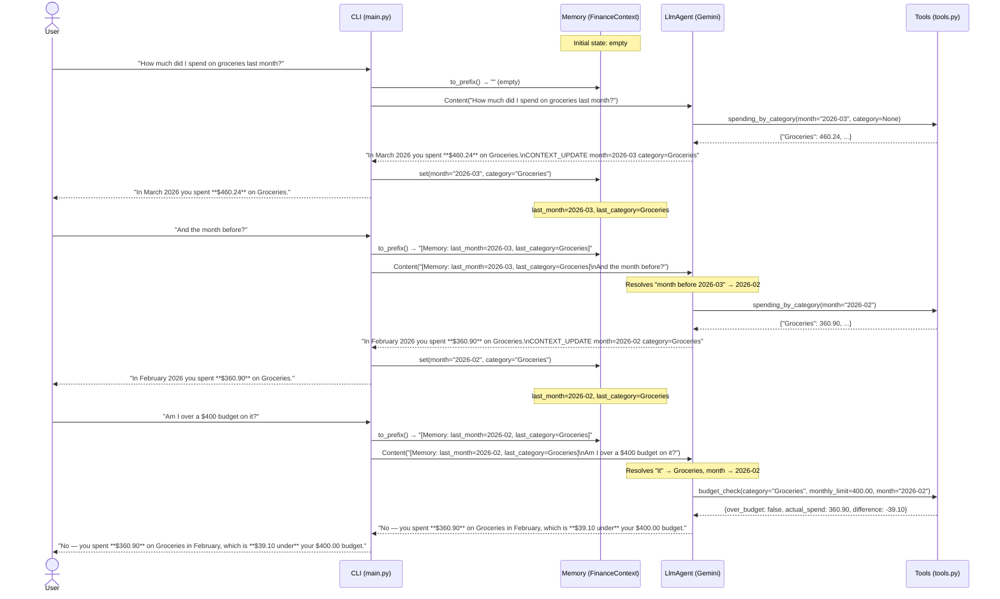

# Usage Flow — Sample Conversation

A three-turn conversation showing how memory flows through the system.

## What this demonstrates

| Turn | Memory read | Tool called | Memory written |
|------|-------------|-------------|----------------|
| 1 | — (empty) | `spending_by_category(month="2026-03")` | `last_month=2026-03, last_category=Groceries` |
| 2 | `last_month=2026-03, last_category=Groceries` | `spending_by_category(month="2026-02")` | `last_month=2026-02` (category unchanged) |
| 3 | `last_month=2026-02, last_category=Groceries` | `budget_check(category="Groceries", month="2026-02")` | unchanged |

The key insight is that the `[Memory: …]` prefix is injected **into the user
message** each turn, so Gemini sees it as part of the conversation and can
resolve anaphoric references ("it", "the month before", "same category")
without any special RAG or vector-search infrastructure.
